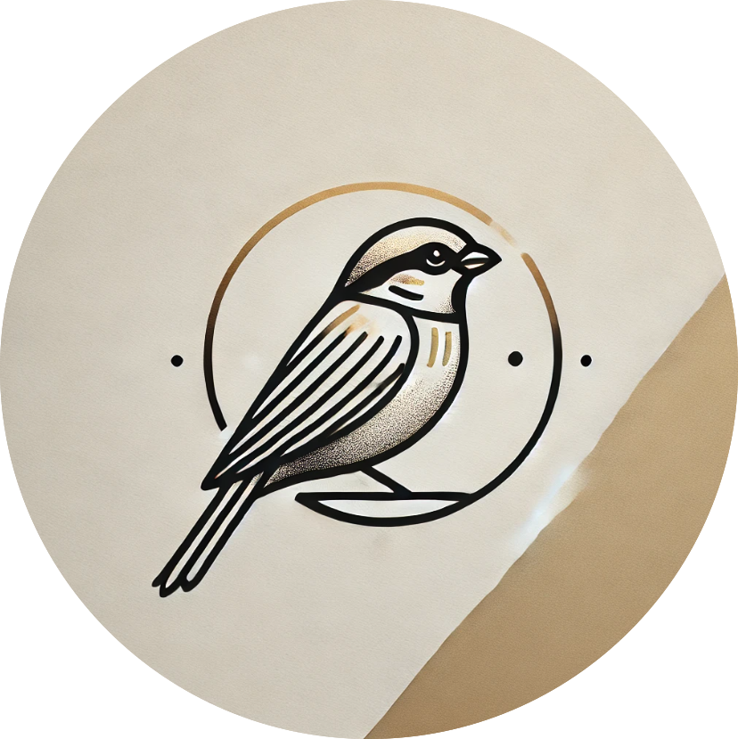

# Sparrow

Sparrow is a tool for automating Helm Pull Request Management and Deployment via PR Comments

<p align="center">
  <br><br>
    <b>Helm Pull Request Automation</b>
</p>

# What is Sparrow?
A Flask application that listens for Helm Chart pull request events via webhooks.

### What does it do?
When a PR is opened to a charts Repo tracked by Sparrow, Sparrow will generate the diffs for changes that would occur if the modified charts were applied and add them in the PR comments. Sparrow supports a single chart being configured for different target environments and will generate the diffs against each environement. You may then command Sparrow to apply the changes for all or a specified set of charts and environments via PR comments.

### Why should you use it?
* Make Helm Chart changes visible to your whole team.
* Enable non-operations engineers to collaborate on Helm Chart Configurations.
* Standardize your Helm workflows.

# Using Sparrow

### Sparrow Commands

* `sparrow diff`: Generate diffs for charts changed in the PR
* `sparrow apply`: Upgrade all of the deployed charts with changes from the PR
  * `-f <chart>@<env>`: target a subset of charts and envrionments when upgrading by passing one or more targets via the `-f` flag

### Creating a Sparrowfile

In order to use sparrow you must define a `sparrowfile.yaml` at the root of you project. A SparrowFile provides Sparrow with the configruations for authenticating to clusters, and generating chart diffs for different environments. In addition to the sparrowfile you may optionally add a `namespace` key and `releaseName` key to the `Charts.yaml` for all charts in your repo that specifies desired namespace and Helm release name for your chart. If not specified the Chart name will be used as the release name and the `default` namespace will be used for releases

Here is an example Sparrowfile:
```yaml
clusters:
  - name: dev-cluster
    provider: azure
    providerConfig:
      clusterName: aks-dev-cluster
      resourceGroup: aks-dev-cluster-rg
  - name: test-cluster
    provider: azure
    providerConfig:
      clusterName: aks-test-cluster
      resourceGroup: aks-test-cluster-rg

chartConfigurations:
  - path: clusters/teamA/ ## This will configure all charts under the path
    environments: ## Map values files to release environments
      - name: dev
        valuesFiles: 
        - values-dev.yaml
        cluster: dev-cluster
      - name: test
        valuesFiles: 
        - values-test.yaml
        cluster: test-cluster
```

The following table provides the currently supported Sparrowfile configurations

| Setting                       |  Description                                                                         | 
| ---                           | ---                                                                                  |
| `clusters`                    | A list of one or more clusters and their provider configurations                     | 
| `clusters[i].name`               | A name for the cluster. Is arbitrary but will be referenced by `chartConfigurations[i].path.environments[i].cluster` | 
| `clusters[i].provider`           | The provider for this cluster. Supported values: `azure`                             | 
| `clusters[i].providerConfig`     | Provider specific details required when authenticating to this cluster. For more details see [Provider Configs](./README.md#provider-configs) | 
| `chartConfigurations`         | A list of configurations for charts in the repository                                     | 
| `chartConfigurations[i].path` | The path to a directory of charts that follow a consistent values file, environment, cluster mapping                    | 
| `chartConfigurations[i].environments` | A list of environments into which charts in the `chartConfigurations[i].path` dir are deployed  | 
| `chartConfigurations[i].environments[j].name` | An arjbitrary name for the environment  | 
| `chartConfigurations[i].environments[j].valuesFiles` | A list of values files that are used to deploy the charts to this environment  | 
| `chartConfigurations[i].environments[j].cluster` | The name of the cluster to deploy to for this environment. This must be a cluster under `clusters`   | 


### Provider Configs

#### Azure

| Setting                                    |  Description                                       | 
| ---                                        | ---                                                |
| `clusters[i].providerConfig.clusterName`   | The name of the AKS cluster in Azure               | 
| `clusters[i].providerConfig.resourceGroup` | The resource group of the AKS cluster in Azure     | 


### Structuring Your Charts
Sparrow is mildly opionated on the structuring of your charts repo. The following layout is a suggestion for those getting started however the tool is flexible if your project structure is different:
```
├── README.md
└── clusters
    ├── team1
    │   └── signoz
    │       ├── Chart.lock
    │       ├── Chart.yaml
    │       ├── README.md
    │       ├── charts/
    │       ├── templates/
    │       ├── values-test.yaml/
    │       └── values-dev.yaml
    └── team2
        └── redis
            ├── Chart.lock
            ├── Chart.yaml
            ├── README.md
            ├── charts/
            ├── templates/
            ├── values-dev.yaml
            └── values-test.yaml
```

# Deploy and Run

An official image is available through ghcr. The creation of a Helm chart is currently in progress. The application can be configured via the following environment variables.

## General

| Variable                      |  Description                                                                         | Default    |
| ---                           | ---                                                                                  | ---        |
| `SPARROW_VCS_BASE_URL`        | The base url for connecting to the API of your VCS platform (ex. https://gitlab.com) | `None`     |
| `SPARROW_VCS_TOKEN`           | Access Token for Authenticating to the API of your platforms                         | `None`     |
| `SPARROW_HELM_VERSION`        | The version of Helm to use for diffs, installation, and upgrade                      | `3.15.0`   |
| `SPARROW_BINARY_PATH`         | The path under which to install any binaries (such as Helm)                          | `/app/bin` |
| `SPARROW_BASIC_AUTH_ENABLED`  | Whether basic authentication to the webhook endpoint should be enabled               | `false`    |
| `SPARROW_BASIC_AUTH_USERNAME` | The username expected for basic auth                                                 | `sparrow`  |
| `SPARROW_BASIC_AUTH_PASSWORD` | The password expected for basic auth                                                 | `worraps`  |
| `SPARROW_ROOT_PATH`           | An optional root path that will be prepended to all routes in the server             | `""`       |
| `SPARROW_ROOT_PATH`           | An optional root path that will be prepended to all routes in the server             | `""`       |

## Azure

Sparrow can be optionally configured to authenticate to Azure Kubernetes Service. Sparrow supports authentication via MSI if you choose to deploy on a compute instance in Azure. However, you can also configure the application to authenticate via a Service Principal (SP).

| Variable                      |  Description                                                                         | Default    |
| ---                           | ---                                                                                  | ---        |
| `AZURE_SUBSCRIPTION_ID`       | Your Azure Subscription ID  (Required for Service Principal Auth)                    | `None`     |
| `AZURE_TENANT_ID`             | Your Azure Tenant ID  (Required for Service Principal Auth)                    | `None`     |
| `AZURE_CLIENT_ID`             | Your Azure SP Client ID  (Required for Service Principal Auth)                       | `None`     |
| `AZURE_CLIENT_SECRET`         | Your Azure SP Client Secret  (Required for Service Principal Auth)                   | `None`     |


## Architecture Ideas and Roadmap
- Could turn this into a distributed design by passing receivers events into message broker for processing.
- Support for:
  - Fresh install diffs
  - VCS Platforms:
    - [] Github
  - K8s Providers:
    - [] Local
    - [] GKE
    - [] EKS
